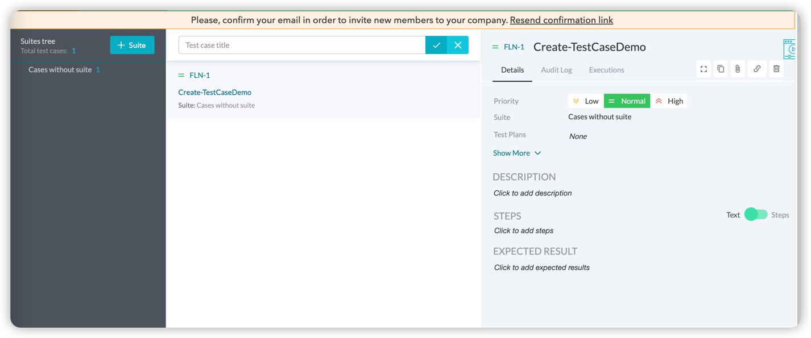
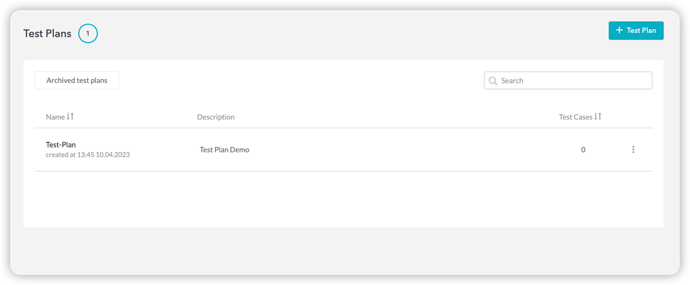

# README

- Test Plan
  - CRUD
  - Relationship with Test Requirement
- Test Requirement
  - CRUD
  - Relationship With Test Plan and Test Case
- Test Case
  - CRUD
  - Relationship With Test Plan,Test Record
- Test Record/Test Run/Test Execution
  - CRUD
  - Relationship With Test Case/Test Plan/Test Requirement

## References

- [kiwitcms](https://kiwitcms.readthedocs.io/en/latest/api/index.html)
- [testcaselab](https://fluentqa.testcaselab.com/projects/FLN/test_cases?sort_dir=desc&sort_attr=created_at&test_case_id=1455524)

## Overview

- Test Case
  - Product/Module Information
  - Test Case Descriptions
  - CRUD Test Case
  - Batch Test Case