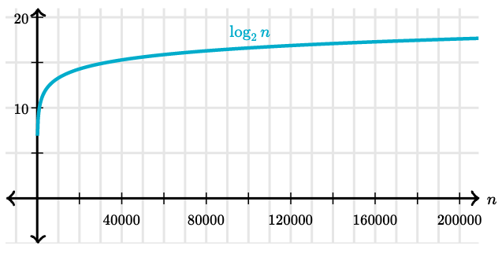
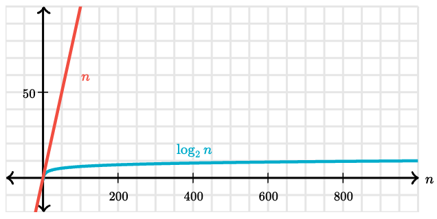

# Binary Search Algorithm

Binary Search is applied on the sorted array or list of large size.
It's time complexity of `O(log n)` makes it very fast as compared to other searching algorithms.
The only limitation is that the array or list of elements must be sorted for the binary search algorithm to work on it.

Here are the steps:

1. Start with the middle element:
   - If the **target** value is equal to the middle element of the array, then return the index of the middle element.
   - If not, then compare the middle element with the target value:
     - If the `target value > number in the middle index` then pick the elements to the right of the middle index, and start with `Step 1`.
     - If the `target value < number in the middle index`, then pick the elements to the left of the middle index, and start with `Step 1`.
2. When a match is found, return the index of the element matched.
3. If no match is found, then return `-1`.

**Why is the time complexity of binary search `O(log n)` and how can we calculate the number of steps required to search an element from a given array without doing any calculations?**

## Counting the Number of Steps

As we have already seen, that with every **incorrect guess**, binary search cuts down the list of elements into half.
So if we start with 32 elements, after first unsuccessful guess, we will be left with 16 elements.

So consider an array with 8 elements, after the first unsuccessful guess, binary search will cut down the list to half, leaving behind 4 elements,
then 2 elements after the second unsuccessful guess, and finally only 1 element will be left, which will either be the target or not, checking that will involve one more step.
So all in all binary search needs at most 4 guesses to search the target in an array with 8 elements.

If the size of the list had been 16, then after the first unsuccessful guess, we would have been left with 8 elements.
And after that, as we know, we need at most 4 guesses, add 1 guess to cut down the list from 16 to 8, that brings us to 5 guesses.

So we can say, _as the number of elements are getting doubled, the number of guesses required to find the target increments by 1_.

> Generalizing this, we can say, for an array with `n` elements:
> 
> the number of times we can repeatedly halve, starting at `n`, until we get the value 1, plus one.

And guess what, in mathematics, the function `log₂ n` means exactly the same.

We have already seen [how the `log` function works](logarithmic-functions.md), did you notice something there?

For `n = 8`, the output of `log₂ n` comes out to be 3, which means the array can be halved 3 times maximum, hence the number of steps (at most) to find the target value will be `(3 + 1) = 4`.

Here's a table showing the base-2 logarithms of various values of `n`:

| n         | log₂(n) |
|-----------|---------|
| 1         | 0       |
| 2         | 1       |
| 4         | 2       |
| 8         | 3       |
| 16        | 4       |
| 32        | 5       |
| 64        | 6       |
| 128       | 7       |
| 256       | 8       |
| 512       | 9       |
| 1024      | 10      |
| 1,048,576 | 20      |
| 2,097,152 | 21      |

Same table as a graph:

> The logarithm function grows very slowly. **Logarithms** are the inverse of **exponentials**.

It is easy to calculate the runtime of a binary search algorithm on an `n` that's exactly a power of 2.

If `n` is 128, binary search will require at most 8 guesses (`log₂(128) + 1`)

**What if `n` isn't a power of 2?** In that case, we can look at the closest lower power of 2.

For an array whose length is 1000, the closest lower power of 2 is 512, which equals `2⁹`.
We can thus estimate that `log₂(1000)` is a number greater than 9 and less than 10, or use a calculator to see that its about 9.97.
Adding one to that yields about 10.97.
In the case of a decimal number, we round down to find the actual number of guesses.
**Therefore, for a 1000-element array, binary search would require at most 10 guesses.**

For the [Tycho-2 star catalog](https://en.wikipedia.org/wiki/Tycho-2_Catalogue) with 2,539,913 stars, the closest lower power of 2 is `2²¹` (which is 2,097,152), so we would need at most 22 guesses.
**Much better than linear search!**

Compare `n` vs `log₂(n)` below:

